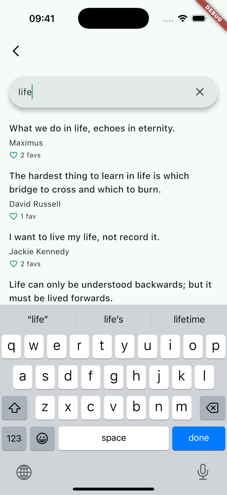

# Quokka

**Quokka** is a mobile application that uses **FavQs API**.

- Dart
- Flutter
- flutter_bloc
- get_it
- go_router
- json_annotation
- json_serializable
- retrofit
- realm
- flutter_secure_storage

## Screenshots

|  |  |  |
|-----------------------------------|----------------------------------|-----------------------------------------|

